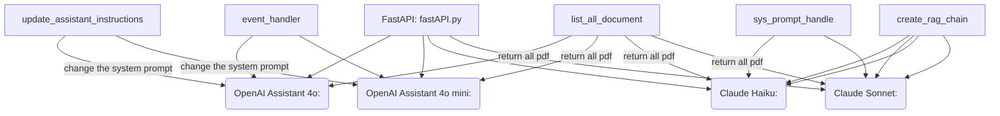

```
! THIS REPO IS FOR AI PROJECT PUBLIC DOCUMENTATION (FOR PUBLIC)
```

# RoboAI Cyberlab Cybersecurity Self-Assessment Tool Chatbot

# Introduction
The project is responses by integrating various AI models, including Claude, OpenAI, using Retrieve-and-Generate (RAG) methodologies. 


## Key Components:
### API Layer (api/):
The fastAPI.py file serves as the entry point for interacting with the system. It provides an API route to retrieve answers from different AI models. For example, the /getAnswerFromClaudeHaiku endpoint processes user queries by invoking the Claude Haiku model and returns the response.

### Models (models/):
This directory contains scripts for specific AI models:

claude_haiku.py: Uses the Claude Haiku model to respond to user queries.

claude_sonnet.py: Uses the Claude Sonnet model for similar purposes.

openAIAssistant_4o.py and openAIAssistant_4omini.py: Interfaces with OpenAI’s assistant models, leveraging the openai-4o and openai-4o-mini models to handle user input.

### Handlers (handlers/):
The handlers directory includes utility scripts that perform various operations, such as creating assistants, storing vector data, updating assistant instructions, and managing the configuration:

assistant_4o_handler.py & assistant_4o_mini_handler.py: These scripts are responsible for creating and managing OpenAI assistants using the respective models, and they store assistant IDs in a configuration file (config.yml).

vector_store_handler.py: Creates and manages a vector store used by OpenAI models to perform RAG-based querying.

update_assistant_instructions.py: Updates the system prompts for OpenAI assistants based on a configuration file (sys_prompt.txt).

sys_prompt_handler.py: Handles the system prompt logic, reading from sys_prompt.txt or returning a default system prompt.

create_rag_chain.py: Sets up the RAG chain that integrates the Claude models with the vector store for generating relevant answers.

list_all_documents.py: Lists all PDF documents that are used for creating vector databases or vector stores.

### Database (database/):
init_chroma.py: creates a local Chroma database, which is used by Claude models to access data stored in vector format. This local database supports the retrieval and generation functionality for Claude-based queries.

### Configuration (config/):
config.yml: Stores configuration details for the application, such as paths for PDF storage, model selection, and other important parameters.

sys_prompt.txt: Contains the system prompt used by OpenAI assistants or other models to maintain a consistent interaction context.

### Dependencies (requirements.txt): 
Lists the external dependencies needed to run the system, ensuring that the project environment is correctly configured for seamless execution.


# **Environment**

1. **Create a virtual environment** and install the required packages:
    
    ```bash
    python -m venv venv
    source venv/bin/activate
    pip install -r requirements.txt
    ```
    
2. **Activate the virtual environment**:
    
    ```bash
    source venv/bin/activate
    ```
    

1. **Add your API key to the system environment variables**:
    
    ```bash
    export OPENAI_API_KEY="your_api_key_here"
    ```
    

# Creating a Vector Store

## If You Already Have a Vector Store in OpenAI:

Update the `config.yml` file to include your vector store ID:

```yaml
openAIAssistant:
  vector_store_id: your_vector_store_id_here
```

## If You Don’t Have a Vector Store:

You have two options to create one:

---

### **Option 1: Automatically Generate a Vector Store from PDFs**

1. Update the `pdf_folder` parameter in the `config.yml` file to point to your folder containing PDFs:
    
    ```yaml
    pdf_folder: your_folder_path_here
    ```
    
2. Run the following command to generate the vector store.
    
    Ensure that the `OPENAI_API_KEY` environment variable is set before running the command.
    
    ```bash
    python3 -m handlers.vector_store_handler
    ```
    
3. The vector store ID will be generated and saved automatically in the `config.yml` file.

---

### **Option 2: Create a Vector Store Manually via OpenAI Platform**

1. Visit: [OpenAI Vector Stores](https://platform.openai.com/storage/vector_stores/)
2. Click **`+ Create`** to create a new vector store.
3. Click **`+ Add Files`** to upload your files to the vector store.
4. Copy the generated vector store ID.
5. Paste the vector store ID into the `config.yml` file:
    
    ```yaml
    openAIAssistant:
      vector_store_id: your_vector_store_id_here
    ```
    


# Creating an OpenAI Assistant with the GPT-4o Model

## If You Already Have an Assistant with the GPT-4o Model:

Update the `config.yml` file with your assistant ID:

```yaml
openAIAssistant:
  assistant_id_4o: your_openai_4o_assistant_id_here
```

## If You Don’t Have an Assistant:

You have two options to create one:

---

### **Option 1: Automatically Create an Assistant**

1. Run the following command to create an assistant with the GPT-4o model:
    
    ```bash
    python3 -m handlers.assistant_4o_handler
    ```
    
2. The assistant will use `sys_prompt.txt` as the system instructions.
    - If `sys_prompt.txt` is not available, the default **NIS2 system instructions** will be used.
3. Ensure that the `OPENAI_API_KEY` environment variable is set before running the command.
4. The generated assistant ID will be saved automatically in the `config.yml` file.

---

### **Option 2: Create an Assistant Manually via OpenAI Platform**

1. Visit: [OpenAI Assistants](https://platform.openai.com/assistants/)
2. Click **`+ Create`** to create a new assistant.
3. Customize the **System Instructions** as needed.
4. Choose the model: **GPT-4o**.
5. Enable the **File Search** feature.
6. Copy the generated assistant ID.
7. Paste the assistant ID into the `config.yml` file:
    
    ```yaml
    openAIAssistant:
      assistant_id_4o: your_openai_4o_assistant_id_here
    ```
    

---


# Creating an OpenAI Assistant with the GPT-4o-Mini Model

## If You Already Have an Assistant with the GPT-4o-Mini Model

Update the `config.yml` file with your assistant ID:

```yaml
openAIAssistant:
  assistant_id_4o-mini: your_openai_4o_mini_assistant_id_here
```

## If You Don’t Have an Assistant

You have two options to create one:

---

### **Option 1: Automatically Create an Assistant**

1. Run the following command to create an assistant with the GPT-4o-Mini model:
    
    ```bash
    python3 -m handlers.assistant_4o_mini_handler
    ```
    
2. Ensure that the `OPENAI_API_KEY` environment variable is set before running the command.
3. The generated assistant ID will be automatically saved in the `config.yml` file.

---

### **Option 2: Create an Assistant Manually via OpenAI Platform**

1. Visit: [OpenAI Assistants](https://platform.openai.com/assistants/)
2. Click **`+ Create`** to create a new assistant.
3. Customize the **System Instructions** as needed.
4. Choose the model: **GPT-4o-Mini**.
5. Enable the **File Search** feature.
6. Copy the generated assistant ID.
7. Paste the assistant ID into the `config.yml` file:
    
    ```yaml
    openAIAssistant:
      assistant_id_4o-mini: your_openai_4o_mini_assistant_id_here
    ```
    

# Test OpenAI Assistant Model

Run the following commands to test the OpenAI Assistant models:

```bash
python3 -m models.openAIAssistant_4o
```

For testing the GPT-4o-Mini model:

```bash
python3 -m models.openAIAssistant_4omini
```

After running the code, the generated answer from the model will appear in the terminal.

# Setting for Claude

In the `config.yml` file, set the following parameters:

```yaml
chromadb_folder: folder_you_want_to_save_chroma
pdf_folder: your_data_input_pdf_folder
```

# Test Claude Model

### Test Claude Model

Before running the code, ensure you have set the environment variables for both the OpenAI API and the Anthropic API:

```bash
export OPENAI_API_KEY="YOUR_OPENAI_API_KEY_HERE"
export ANTHROPIC_API_KEY="YOUR_CLAUDE_API_KEY_HERE"
```

Then, run the following commands to test the Claude models:
The first time use will generate vector db, so it will be slower
1. For the **Claude Haiku** model:
    
    ```bash
    python3 -m models.claude_haiku
    ```
    
2. For the **Claude Sonnet** model:
    
    ```bash
    python3 -m models.claude_sonnet
    ```
    

# Running the API

## **If Using SAMK AI Server**

Run the following command to start the API using FastAPI on the server:

```bash
screen -S api_screen -d -m uvicorn api.fastAPI:app --reload --port 8888 --host "0.0.0.0"

```

Once the server is running, the Jupyter link and API address will be available in the AI server details. For example:

- **API Address**: `http://ailab2.samk.fi:2567`


## **If Using Your Computer**

Run the following command to start the API on your local machine:

```bash
bash
Copy code
screen -S api_screen -d -m uvicorn fastAPI:app --reload --port 8000

```

- **API Address**: [http://127.0.0.1:8000](http://127.0.0.1:8000/)

# Demo to Use the API

Here are the demo links to interact with the various models:

## OpenAI Assistant 4o mini

http://ailab2.samk.fi:2567/getAnswerFromOpenaiAssistant4omini?query=Kuinka

yksityiskohtainen riskienarviointimenetelmämme tulisi olla täyttääkseen vaatimukset?

## OpenAI Assistant 4o

http://ailab2.samk.fi:2567/getAnswerFromOpenaiAssistant4o?query=Kuinka

yksityiskohtainen riskienarviointimenetelmämme tulisi olla täyttääkseen vaatimukset?

## Claude Haiku

http://ailab2.samk.fi:2567/getAnswerFromClaudeHaiku?query=Kuinka

yksityiskohtainen riskienarviointimenetelmämme tulisi olla täyttääkseen vaatimukset?

## Claude Sonnet

http://ailab2.samk.fi:2567/getAnswerFromClaudeSonnet?query=Kuinka

yksityiskohtainen riskienarviointimenetelmämme tulisi olla täyttääkseen vaatimukset?

# Change System Prompt

If you want to change the system prompt:

- Modify the `sys_prompt.txt` file, and Claude will automatically update.
- To update OpenAI Assistant system instructions, run:
    
    ```bash
    python3 update_assistant_instructions.py
    ```
    

This will update the instructions for your OpenAI Assistant model.

### License

This repository is licensed under the [Creative Commons Attribution 4.0 International License (CC BY 4.0)](https://creativecommons.org/licenses/by/4.0/).

### Sponsors and Collaboration

This project was carried out in collaboration with [Satakunta University of Applied Sciences](https://www.samk.fi), [RoboAI](https://www.roboai.fi), and the [Kytee – Kyberturvaa Satakunnan teollisuuteen](https://www.roboai.fi/tutkimus-ja-tuotekehitys/projektit/kytee/).

   
